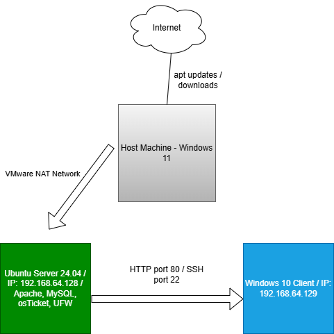
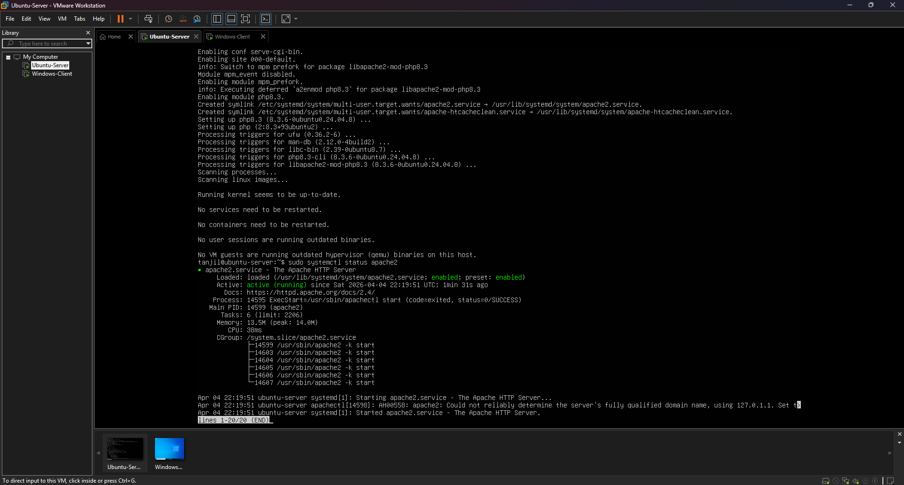
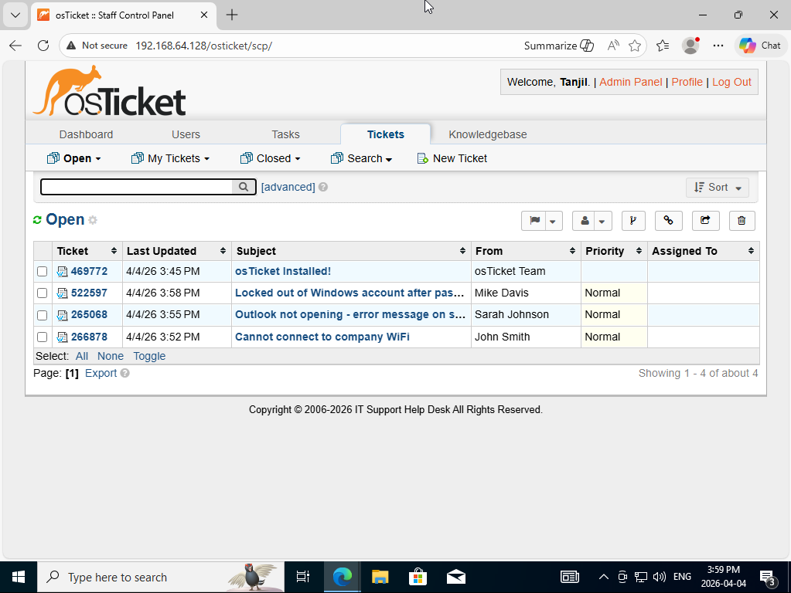
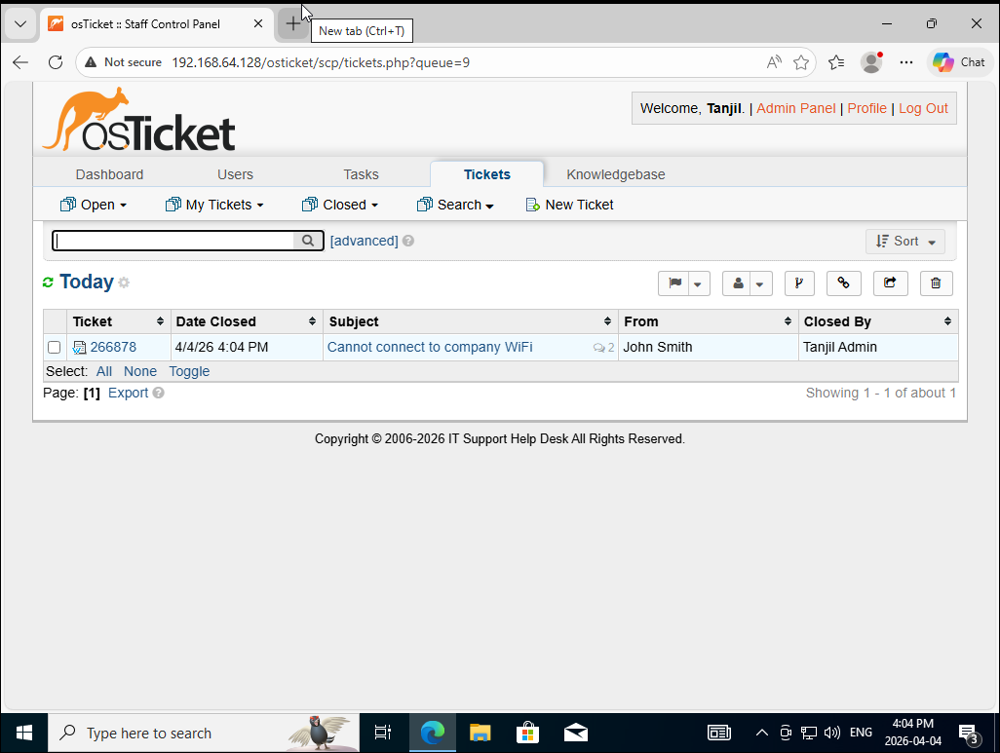
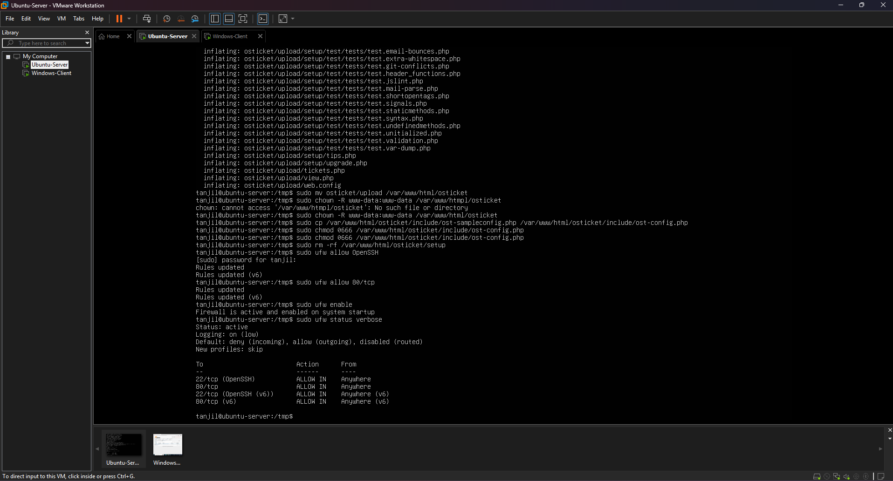

# IT Support Home Lab — osTicket Help Desk

A self-directed IT support home lab built using VMware Workstation, 
Ubuntu Server 24.04, and Windows 10. This project simulates a real 
help desk environment using osTicket as the ticketing system.

## Lab Environment

| Component | Details |
|---|---|
| Host Machine | Windows 11 |
| Server VM | Ubuntu Server 24.04 — IP: 192.168.64.128 |
| Client VM | Windows 10 — IP: 192.168.64.129 |
| Network | VMware NAT |

## What Was Built

- Deployed Apache web server and MySQL database on Ubuntu Server
- Installed and configured osTicket v1.18.1 help desk system
- Configured UFW firewall — allowed ports 22 (SSH) and 80 (HTTP)
- Created and resolved realistic IT support tickets
- Documented troubleshooting steps in a runbook

## Technologies Used

`Ubuntu Server 24.04` `Apache2` `MySQL` `PHP` `osTicket` 
`UFW Firewall` `OpenSSH` `VMware Workstation` `Windows 10`

## Network Diagram

## Screenshots

### Apache Web Server Running

### osTicket Installation Success

### Admin Panel — Ticket Queue

### Resolved Ticket

### UFW Firewall Rules

## Documentation

- [Troubleshooting Runbook](IT_Support_Home_Lab_-_Troubleshooting_Runbook.docx)

## Skills Demonstrated

- Linux server administration
- Web server setup and configuration (Apache)
- Database management (MySQL)
- Help desk ticketing workflow (osTicket)
- Firewall configuration (UFW)
- Network troubleshooting and documentation
- Virtual machine management (VMware)
